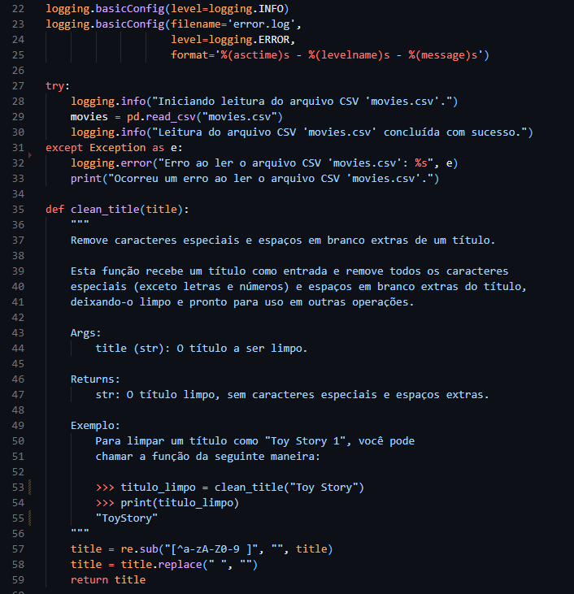
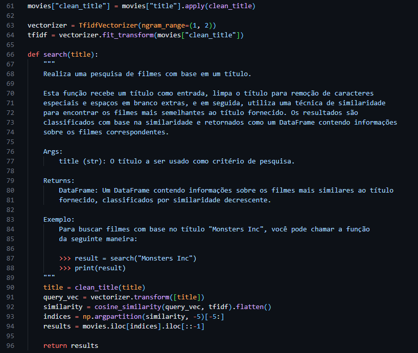
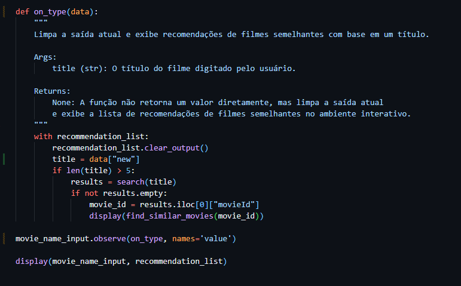
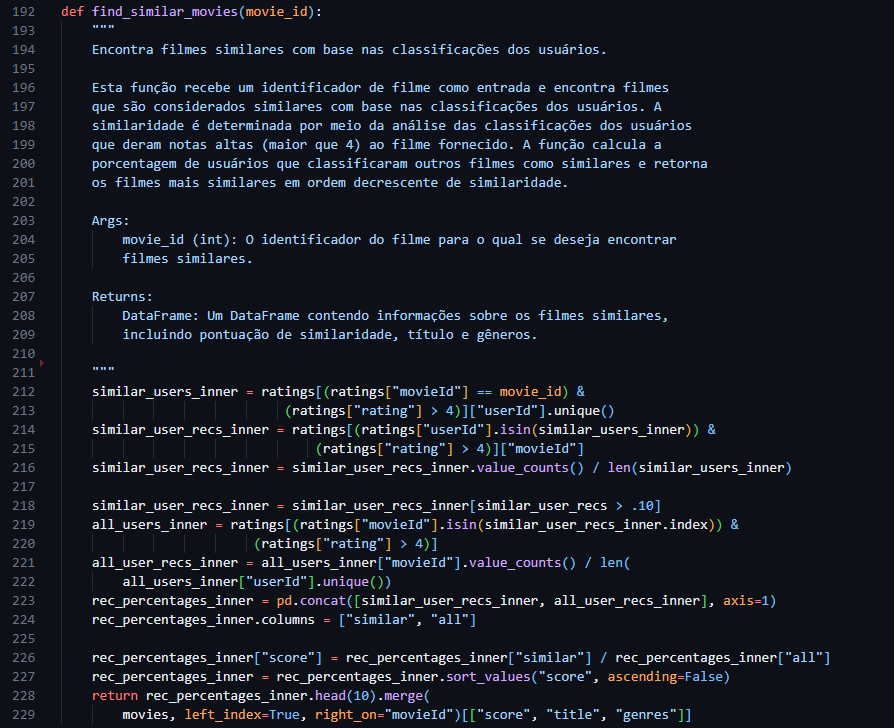
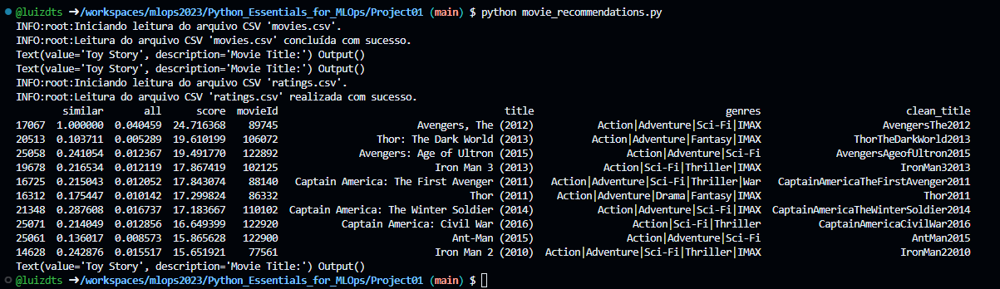
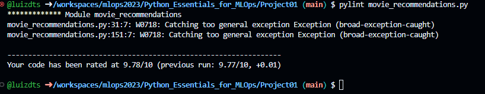
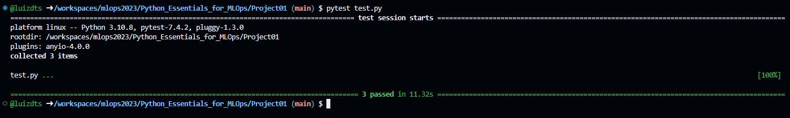

# Build a Movie Recommendation System in Python

## Introdução

Neste projeto, iremos construir um sistema interativo de recomendação de filmes que permite que você digite o nome de um filme e obtenha imediatamente dez recomendações de outros filmes que você pode querer assistir. Assim será criado um sistema interativo que nos permitirá digitar o nome de um filme, como "Toy Story", e o ano de seu lançamento para obter recomendações de outros filmes que podemos gostar. Portanto, se gostarmos de "Toy Story", provavelmente também vamos apreciar assistir a "Toy Story 2", "A Bug's Life" e "Monsters Inc".

## Tecnologias Utilizadas

Os principais pacotes que compõe esse projeto são:

- Python 3.8+
- Logging
- numpy
- pandas
- Pylint
- Pytest
- re
- Sklearn

## Instalação

Descreva as etapas necessárias para que outras pessoas possam instalar e configurar o seu projeto em seu ambiente local. Certifique-se de incluir todos os pré-requisitos, comandos e configurações necessárias. Por exemplo:

1. Acesse a pasta deste projeto no repositório:
   ```bash
   cd mlops2023/Python_Essentials_for_MLOps/Project01
   ```
2. Realize a instalação do Pylint:
   ```
   pip install pylint
   ```
3. Realize a instalação do Pytest:
   ```
   pip install pytest
   ```
4. Para instalar os demais pacotes utilize o comando pip:
   ```
   pip install nome_do_pacote
   ```

## Código

O código pode ser executado a partir do comando:
   ```
   python movie_recommendations.py
   ```
Visto que podemos fornecer um ID de um filme para que seja feita a busca do filme e suas recomendações baseadas em avaliação.

As imagens abaixo representa como está dividida a estrutura do código, nesse código foram aplicadas as seguintes práticas:
- Código limpo: foram utilizadas as técnicas de DRY (Don't Repeat Yourself) e KISS (Keep It Simple Stupid) na tentativa de tornar o código mais legível e fácil de manutenção para quem for utilizá-lo e aprimorá-lo.
- Logging: utilizado para mostrar, no terminal o estado atual de execução do programa, nesse projeto temos dois identificadores INFO e ERROR, eles são responsáveis por mostrar informações da execução de um determinado trecho de código, a flag INFO é responsável por mostrar apenas informações de execução, enquanto a flag ERROR é responsável por indicar erros que ocorreram durante a execução do programa em questão, apontando o local de erro em um arquivo de log.
- Modularização: é uma prática que ajuda a tornar o código mais eficiente, legível e fácil de manter, ao mesmo tempo em que promove a reutilização de código e facilita o trabalho em equipe.
- Testes Unitários:  ajudam a identificar e corrigir erros de forma precoce, melhoram a confiabilidade do código e permitem a refatoração segura. Eles também são uma parte importante das metodologias de desenvolvimento ágil, como o Test-Driven Development (TDD), onde os testes são escritos antes do código de produção.


O trecho de código abaixo usa o módulo logging para registrar informações sobre o processo de leitura do arquivo CSV, bem como qualquer erro que possa ocorrer. A função clean_title recebe um título como entrada e remove todos os caracteres especiais (exceto letras e números) e espaços em branco extras do título, deixando-o limpo e pronto para uso em outras operações.



Após abrir e realizar a leitura dos dados existentes no CSV, a função search funciona a partir de um título como entrada, limpa o título para remoção de caracteres especiais e espaços em branco extras, e em seguida, utiliza uma técnica de similaridade para encontrar os filmes mais semelhantes ao título fornecido. Os resultados são classificados com base na similaridade e retornados como um DataFrame contendo informações sobre os filmes correspondentes.



A função on_type é responsável por exibir recomendações de filmes semelhantes baseado em um título fornecido.


A função find_similar_movies busca filmes similares de acordo com a classificação dos usuários, recebe um identificador de filme como entrada e encontra filmes que são considerados similares com base nas classificações dos usuários. A similaridade é determinada por meio da análise das classificações dos usuários que deram notas altas (maior que 4) ao filme fornecido.



## Resultados Obtidos

1. Saída da execução do movie_recommendations.py
   
2. Saída do resultado do Pylint:
   
3. Saída do resultado dos testes unitários:
   
