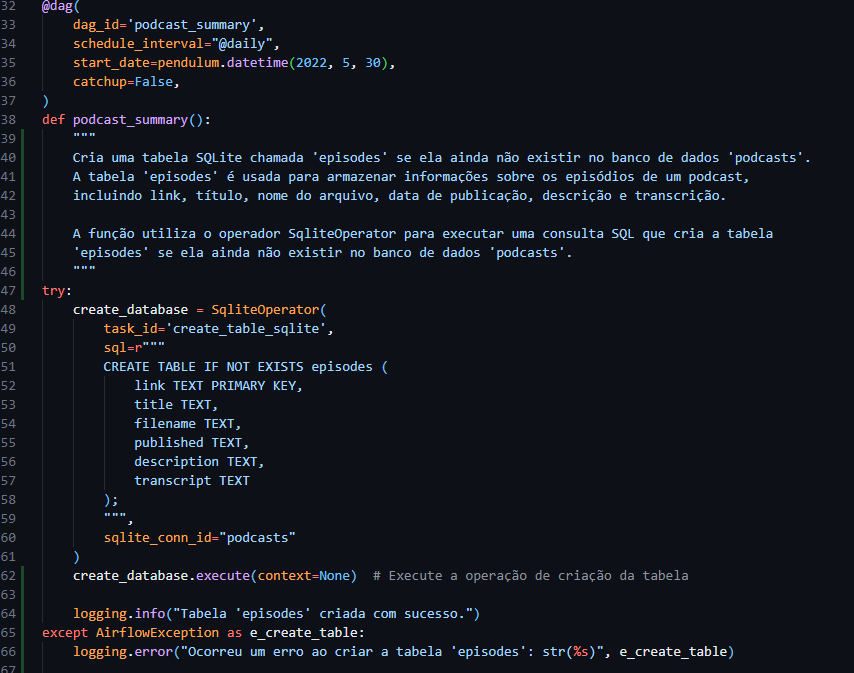
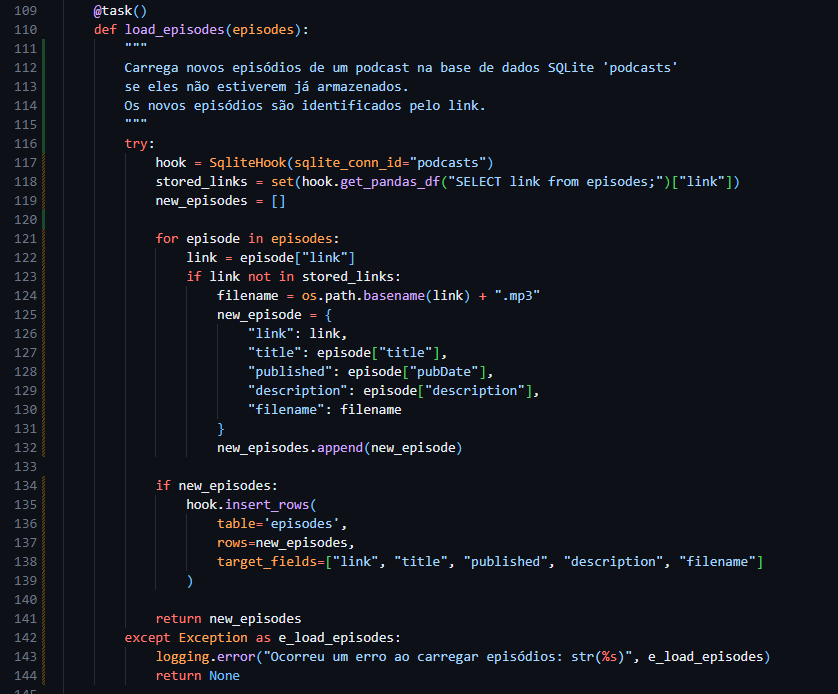
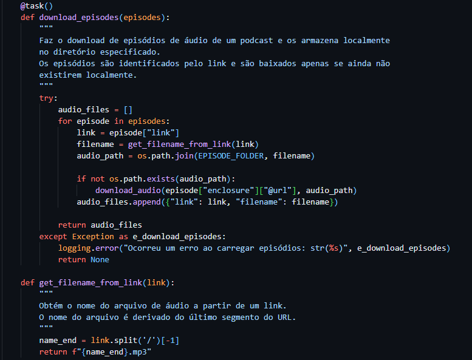
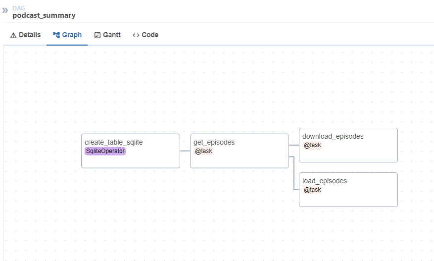
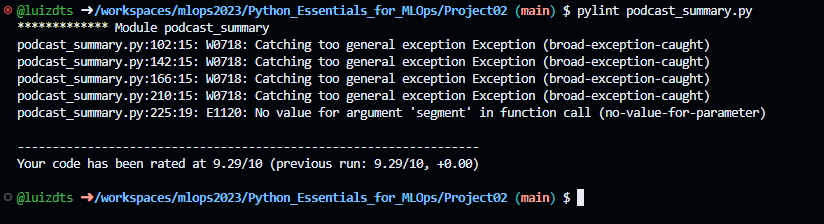

# Build an Airflow Data Pipeline to Download Podcasts

## Introdução

Para esse projeto, iremos focar em uma aplicação onde utiliza 
Vamos construir um pipeline de dados em quatro etapas usando o Airflow, que é uma ferramenta popular de engenharia de dados baseada em Python para definir e executar pipelines de dados muito poderosos e flexíveis. O pipeline irá baixar episódios de podcasts. Vamos armazenar nossos resultados em um banco de dados SQLite que podemos consultar facilmente. 

## Tecnologias Utilizadas

Os principais pacotes que compõe esse projeto são:

- Python3.8+
- Airflow
- Logging
- pydub
- Pylint
- Pytest
- virtualenv
- vosk
- xmltodict 
- requests

## Instalação

1. Acesse a pasta deste projeto no repositório
   ```bash
    cd mlops2023/Python_Essentials_for_MLOps/Project02
   ```
2. Realize a instalação do Pylint:
   ```
   pip install pylint
   ```
3. Realize a instalação do Pytest:
   ```
   pip install pytest
   ```
4. Para instalar os demais pacotes utilize o comando pip:
    ```
    pip install nome_do_pacote
    ```
5. Instale o pacote para criar o ambiente virtual:
   ```
   pip install virtualenv
   ```
6. Crie o ambiente virtual:
   ```
   python3 -m venv airflow
   ```
7. Acesse o ambiente virtual:
   ```
   source airflow/bin/activate
   ```
8. Para instalar o Airflow no ambiente virtual digite o comando:
   ```bash
   CONSTRAINT_URL="https://raw.githubusercontent.com/apache/airflow/constraints-2.3.1/constraints-3.8.txt"
   pip install "apache-airflow==2.3.1" --constraint "${CONSTRAINT_URL}"
   ```
9. Após a instalação, o ambiente do Airflow pode ser inicializado usando o seguinte comando:
    ```
    airflow standalone
    ```
10. Para encerrar o ambiente virtual do Airflow utiliza-se o seguinte comando:
    ```
    Para finalizar o Airflow: Ctrl+C 
    Para finalizar o ambiente virtual: deactivate
    ```

Para criar a conexão com o banco de dados SQLite, utilizamos os seguintes comandos:
```
   sudo apt install sqlite3
   sqlite3 episodes.db
   .databases
   .quit
```
Em seguida, no ambiente virtual, digite o seguinte comando para que possa ser criada a conexão do SQLite
```
   airflow connections add 'podcasts' --conn-type 'sqlite' --conn-host '/home/luiz/episodes.db'
```
## Código

As imagens abaixo representa como está dividida a estrutura do código, nesse código foram aplicadas as seguintes práticas:
- Código limpo: foram utilizadas as técnicas de DRY (Don't Repeat Yourself) e KISS (Keep It Simple Stupid) na tentativa de tornar o código mais legível e fácil de manutenção para quem for utilizá-lo e aprimorá-lo.
- Logging: utilizado para mostrar, no terminal o estado atual de execução do programa, nesse projeto temos dois identificadores INFO e ERROR, eles são responsáveis por mostrar informações da execução de um determinado trecho de código, a flag INFO é responsável por mostrar apenas informações de execução, enquanto a flag ERROR é responsável por indicar erros que ocorreram durante a execução do programa em questão, apontando o local de erro em um arquivo de log.
- Modularização: é uma prática que ajuda a tornar o código mais eficiente, legível e fácil de manter, ao mesmo tempo em que promove a reutilização de código e facilita o trabalho em equipe.
- Testes Unitários:  ajudam a identificar e corrigir erros de forma precoce, melhoram a confiabilidade do código e permitem a refatoração segura. Eles também são uma parte importante das metodologias de desenvolvimento ágil, como o Test-Driven Development (TDD), onde os testes são escritos antes do código de produção.

DAGs (Directed Acyclic Graphs) no Airflow são representações de fluxos de trabalho ou tarefas em um ambiente de orquestração de tarefas. Eles são usados para definir a sequência de tarefas a serem executadas, com dependências entre elas, de forma que seja possível agendar, monitorar e gerenciar fluxos de trabalho de forma eficiente. Dessa forma, definimos as Tasks que a DAG irá executar. 

Com isso, no código abaixo, mostramos como está a configuração da DAG, o nome, intervalo de agendamento e o dia de início (alterado para o dia atual), assim devemos criar a tabela que será utilizada no SQLite3 para o próprio Aiflow, assim podemos verificar a partir dos logs se a tabela foi criada ou não.



A função load_episodes() carrega os novos episódios de um podcast do banco de dados criado no SQLite, caso ele não estejam armazenados, quando existe um novo episódio é criado um novo identificador.



Essa função realiza o download de episódios de áudio e armazena-os em um diretório específico e o nome dos arquivos baixados no formato MP3.




## Resultados Obtidos

1. DAG criada do podcast_summary.py no Airflow 
   
2. Saída do resultado do Pylint:
   

Neste projeto, não foi possível criar testes unitários que possibilitassem verificar a segurança e validação do código.

## Conclusão

A adoção de práticas como DRY, KISS, logging, modularização e testes unitários oferece uma série de benefícios que incluem a redução de erros, melhoria da qualidade do código, facilidade de manutenção, rastreabilidade de eventos e a capacidade de colaborar eficazmente em projetos de desenvolvimento de software. Essas práticas são essenciais para criar software eficiente, robusto e sustentável. 

A aplicação consistente dessas práticas ao longo do ciclo de vida do desenvolvimento de software ajuda a melhorar a eficiência e a qualidade do código, resultando em sistemas mais confiáveis e de fácil manutenção.