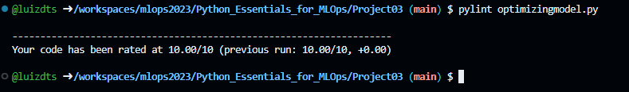

# Optimizing Machine Learning Models in Python

Certificado: https://app.dataquest.io/view_cert/2U8DT447VX19TLLEIHM4
## Introdução

Para esse projeto, em vez de seguir com um único modelo, começaremos com um modelo de referência e, em seguida, iteraremos sobre ele usando as técnicas deste curso para otimizá-lo. Nosso modelo de referência será um modelo padrão de regressão linear e nossa tarefa de aprendizado de máquina será prever a extensão dos danos causados por incêndios em uma floresta. Nossos dados provêm do conjunto de dados "Forest Fires" do repositório de Aprendizado de Máquina da UCI (UCI Machine Learning Repository). Este conjunto de dados contém informações sobre incêndios, juntamente com os danos resultantes e dados meteorológicos associados. Queremos saber como essas características podem ser úteis na previsão de danos futuros causados por incêndios.

## Tecnologias Utilizadas

Os principais pacotes que compõe esse projeto são:

- Python 3.8+
- Logging
- numpy
- pandas
- Pylint
- Pytest
- Sklearn

## Instalação

Descreva as etapas necessárias para que outras pessoas possam instalar e configurar o seu projeto em seu ambiente local. Certifique-se de incluir todos os pré-requisitos, comandos e configurações necessárias. Por exemplo:

1. Acesse a pasta deste projeto no repositório
   ```bash
      cd mlops2023/Python_Essentials_for_MLOps/Project03
   ```
2. Realize a instalação do Pylint:
   ```
   pip install pylint
   ```
3. Realize a instalação do Pytest:
   ```
   pip install pytest
   ```
4. Para instalar os demais pacotes utilize o comando pip:
   ```
   pip install nome_do_pacote
   ```

## Código

As imagens abaixo representa como está dividida a estrutura do código, nesse código foram aplicadas as seguintes práticas:
- Código limpo: foram utilizadas as técnicas de DRY (Don't Repeat Yourself) e KISS (Keep It Simple Stupid) na tentativa de tornar o código mais legível e fácil de manutenção para quem for utilizá-lo e aprimorá-lo.
- Logging: utilizado para mostrar, no terminal o estado atual de execução do programa, nesse projeto temos dois identificadores INFO e ERROR, eles são responsáveis por mostrar informações da execução de um determinado trecho de código, a flag INFO é responsável por mostrar apenas informações de execução, enquanto a flag ERROR é responsável por indicar erros que ocorreram durante a execução do programa em questão, apontando o local de erro em um arquivo de log.
- Modularização: é uma prática que ajuda a tornar o código mais eficiente, legível e fácil de manter, ao mesmo tempo em que promove a reutilização de código e facilita o trabalho em equipe.
- Testes Unitários:  ajudam a identificar e corrigir erros de forma precoce, melhoram a confiabilidade do código e permitem a refatoração segura. Eles também são uma parte importante das metodologias de desenvolvimento ágil, como o Test-Driven Development (TDD), onde os testes são escritos antes do código de produção.

Este código lida com a leitura de um arquivo CSV, tratando possíveis exceções, e em seguida, realiza a preparação dos dados para a construção de um modelo de regressão linear. A função count_missing_values() realiza a  contagem do número de valores ausentes em uma coluna específica de um DataFrame.


Esta função cria um modelo de regressão linear com seleção de características
usando SequentialFeatureSelector da biblioteca scikit-learn. O modelo é treinado para selecionar um número específico de características.


O código abaixo está testando diferentes configurações de modelos de regressão linear, variando o número de características selecionadas. A informação registrada no log é útil para acompanhar quais características foram selecionadas para cada modelo, o que pode ser fundamental na análise e interpretação dos resultados de um modelo de regressão linear.


## Resultados Obtidos

1. Saída optimizatingmodel.py:
      
2. Saída do resultado do Pylint:
   
3. Saída do resultado dos testes unitários:
   

## Conclusão

A adoção de práticas como DRY, KISS, logging, modularização e testes unitários oferece uma série de benefícios que incluem a redução de erros, melhoria da qualidade do código, facilidade de manutenção, rastreabilidade de eventos e a capacidade de colaborar eficazmente em projetos de desenvolvimento de software. Essas práticas são essenciais para criar software eficiente, robusto e sustentável. 

A aplicação consistente dessas práticas ao longo do ciclo de vida do desenvolvimento de software ajuda a melhorar a eficiência e a qualidade do código, resultando em sistemas mais confiáveis e de fácil manutenção.