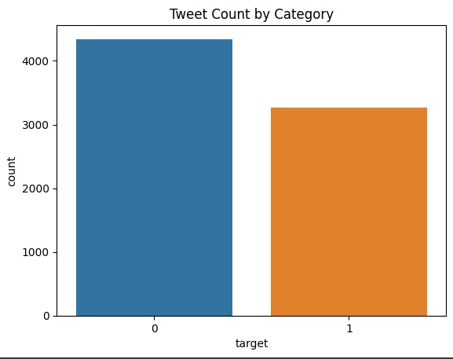
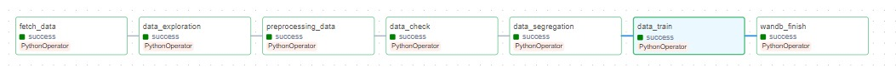
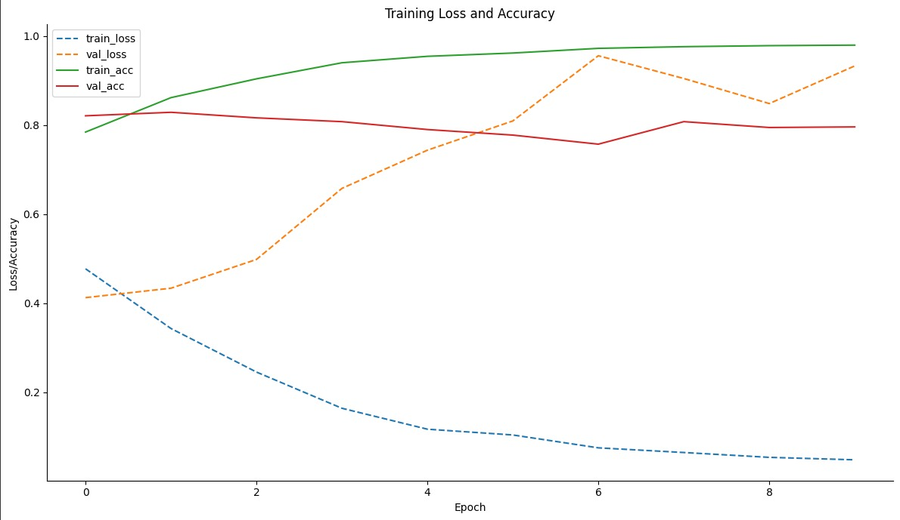

# MLOps

  

Este repositório contém o projeto referente à segunda unidade da disciplina de Projeto de Sistemas Baseados em Aprendizado de Máquina - DCA0305 do curso de Engenharia de Computação da Universidade Federal do Rio Grande do Norte.

Este projeto consiste em realizar a criação de DAGs e aplicação de boas práticas de programação em um projeto guiado da plataforma Dataquest.io chamado Classifying Disaster-Related Tweets as Real or Fake, esse projeto guiado verifica se os tweets possuem relacionados à desastres naturais se são verdadeiros ou não.

# Projeto

O projeto Classifying Disaster-Related Tweets as Real or Fake que constrói um modelo de classificação de texto de aprendizado profundo que preveja quais Tweets são sobre desastres reais e quais não são. O conjunto de dados vem do [Kaggle](https://www.kaggle.com/competitions/nlp-getting-started/overview).

## Descrição do Conjunto de Dados
Os dados são provenientes da competição do Kaggle, incluindo os seguintes arquivos:
- train.csv: Conjunto de treinamento com exemplos rotulados.
- test.csv: Conjunto de testes para avaliação do modelo.
- sample_submission.csv: Exemplo de arquivo de envio no formato correto.

### Informações Contidas nos Dados:
- id: Identificador único para cada tweet.
- text: Texto do tweet.
- location: Local de onde o tweet foi enviado (opcional).
- keyword: Palavra-chave associada ao tweet.
- target: Somente em train.csv, indica se um tweet é sobre um desastre real (1) ou não (0).

  

O objetivo é prever, para cada tweet no conjunto de testes, se está relacionado a um desastre real (1) ou não (0).

## Pré-processamento de Dados

O pré-processamento dos dados é uma etapa crucial para preparar os tweets para a modelagem. As seguintes técnicas são aplicadas:

1. *Limpeza de Dados:*
   - Remoção de colunas desnecessárias como id, keyword e location.
   - Conversão do texto dos tweets para letras minúsculas.

2. *Tratamento de Texto:*
   - Remoção de caracteres não alfabéticos e substituição por espaços.
   - Tokenização: Transformação do texto em uma lista de palavras ou tokens.

3. *Remoção de Stopwords:*
   - Exclusão de palavras comuns que não contribuem para o significado do texto, como 'the', 'is', etc.

4. *Lematização:*
   - Conversão das palavras para sua forma base ou de dicionário (por exemplo, "running" para "run").

5. *Reconstrução de Texto:*
   - Reagrupamento das palavras processadas em uma string contínua para análise posterior.

Estas técnicas ajudam a reduzir o ruído nos dados e melhorar a eficácia do modelo de machine learning.

# Ferramentas utilizadas
    
## Tecnologias e Ferramentas
- Python, TensorFlow, NLTK, scikit-learn, pandas, numpy, seaborn, matplotlib.
- Apache Airflow para orquestração.
- Docker para ambiente padronizado.
- Weights & Biases para rastreamento de experimentos.

- Dependências Python utilizadas no projeto:
    - tensorflow
    - os
    - re
    - requests
    - wandb
    - nltk
    - pytest
    - logging
    - subprocess
    - pandas
    - json
    - seaborn
    - matplotlib.pyplot
    - datetime
    - airflow
    - transformers

## Descrição do projeto

Para a implementação do projeto <i>Classifying Disaster-Related Tweets as Real or Fake</i> disponibilizado pelo Dataquest deve ser refatorado para um arquivo Python, para isso os trechos de código foram reorganizados em funções para cada etapa, nosso código ficou dividido nas seguintes etapas:
- fetch_data
- data_exploration
- preprocessing_data
- data_check
- data_segregation
- data_train
- wandb_finish

## Pipeline do Projeto

### 1. Configuração Inicial
- *Logging:* Configuração de logging para monitoramento do processo.
- *Weights & Biases (wandb):* Configuração inicial para rastreamento de experimentos.

### 2. Coleta de Dados (fetch_data)
- *Download de Dados:* Coleta automática de um dataset de tweets.
- *Registro no wandb:* Os dados brutos são registrados como um artefato no wandb.

### 3. Exploração de Dados (data_exploration)
- *Análise Exploratória:* Contagem de valores alvo, normalização e geração de visualizações.
- *Registros e Visualizações:* Registro das análises e imagens de gráficos no wandb.

### 4. Pré-processamento de Dados (preprocessing_data)
- *Limpeza e Preparação:* Remoção de colunas desnecessárias e aplicação de técnicas de NLP como tokenização, remoção de stopwords, e lematização.
- *Registro no wandb:* Os dados limpos são registrados como um novo artefato.

### 5. Verificação de Dados (data_check)
- *Testes Automatizados:* Utilização de pytest para validar a integridade dos dados.

### 6. Segregação de Dados (data_segregation)
- *Divisão em Conjuntos de Treino e Teste:* Separação dos dados em dois conjuntos para treinamento e teste do modelo.
- *Registro no wandb:* Os conjuntos de dados divididos são registrados como artefatos.

### 7. Treinamento do Modelo (data_train)
- *Construção e Treinamento:* Definição do modelo usando TensorFlow e treinamento com os dados de treino.
- *Visualizações de Treinamento:* Gráficos de perda e acurácia durante o treinamento são gerados e registrados no wandb.

### 8. Finalização do Registro no wandb (wandb_finish)
- *Conclusão:* Encerramento da sessão de rastreamento do experimento no wandb.

### 9. Orquestração com Apache Airflow
- *DAG Configuration:* Configuração da Directed Acyclic Graph (DAG) para automação do processo.
- *Tarefas Airflow:* Definição das tarefas Python para cada etapa do pipeline.

# Execução do projeto
### Requisitos
- Python 3.8 ou superior.
- Bibliotecas Python: pytest, wandb, pandas, numpy, tensorflow, nltk, entre outras listadas em requirements.txt.
- Weights & Biases (wandb) para rastreamento de experimentos (requer conta e API key).

### Instruções para Execução

1. *Instalação de Dependências:*
   - Instale todas as dependências Python utilizando pip install -r requirements.txt.

2. *Configuração do Weights & Biases:*
   - Configure a chave API do wandb, obtida após o registro no site oficial.

3. *Execução dos Testes:*
   - Execute os testes automatizados com pytest para garantir a integridade dos dados.

4. *Treinamento e Avaliação do Modelo:*
   - Execute o script principal (mlops_verifying_tweets.py) para iniciar o processo de treinamento e avaliação do modelo.

5. *Visualização e Análise de Resultados:*
   - Acesse o painel do wandb para visualizar e analisar os resultados do treinamento e dos testes.

# Resultados obtidos

# Vídeo de apresentação
Apresentação do projeto no [link](https://drive.google.com/file/d/1IjTJCU07UgZqCoGPEG4R0ythw2xyqCCX/view?usp=drive_link)

# Grupo

- Guilherme Pablo Santana
- Henrique Hideaki Koga
- Luiz Henrique Araújo Dantas

# Referências

- Dataquest
- Weights & Biases - wandb
- Dr. Ivanovitch Medeiros Dantas da Silva 

