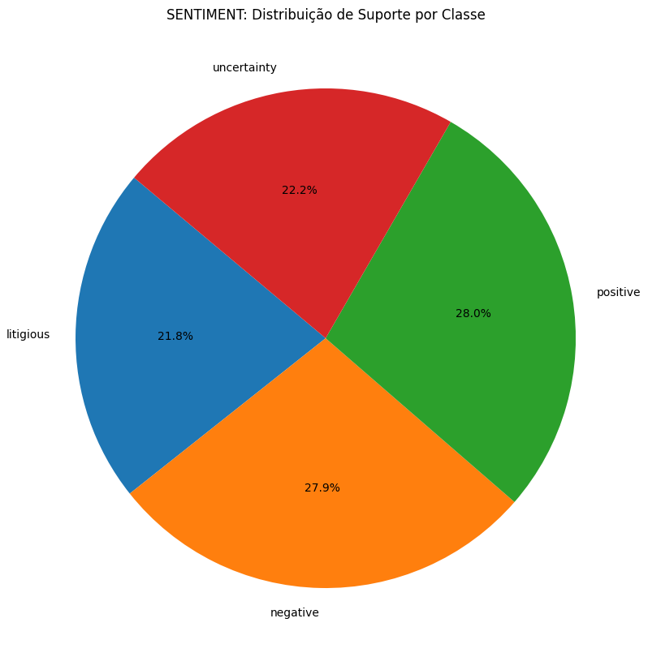

# MLOps

<p align="center">
  
</p>


Este repositório contém o projeto referente à terceira unidade da disciplina de Projeto de Sistemas Baseados em Aprendizado de Máquina - DCA0305 do curso de Engenharia de Computação da Universidade Federal do Rio Grande do Norte.

Este projeto consiste em realizar a criação de um pipeline e aplicação de boas práticas de programação em um projeto de sistema avançado de processamento de linguagem natural (NLP) e machine learning.

# Projeto

O projeto principal é um sistema avançado de processamento de linguagem natural (NLP) e machine learning, focado na análise e classificação de textos. Seu objetivo é identificar características específicas dos textos, como o idioma e o sentimento expresso, utilizando para isso um conjunto de dados contendo textos, seus idiomas correspondentes e rótulos de sentimentos.

O tema central do projeto é a análise de texto usando NLP e machine learning. Ele aborda dois aspectos principais: a identificação do idioma do texto e a classificação do sentimento expresso. Esse sistema tem uma ampla gama de aplicações práticas, como monitoramento de mídia social, análise de feedback de clientes, moderação de conteúdo, e muitas outras situações onde a compreensão automática de textos é valiosa.


## Funcionalidades e Componentes do Projeto:

Análise de Texto: O projeto utiliza um conjunto de dados (dataset.csv) que inclui textos em diferentes idiomas, cada um com um rótulo de sentimento associado, como 'positivo', 'negativo' ou 'litigioso'. Este conjunto de dados é a base para todas as análises e modelagem do projeto.

Processamento de Dados: Antes de qualquer análise, os dados são carregados e passam por um processo de limpeza e preparação, que pode incluir a remoção de caracteres especiais, normalização de texto e outras transformações necessárias para a análise de NLP.

Machine Learning: O código do projeto revela a utilização de algoritmos de machine learning, como LinearSVC e MultinomialNB, para treinar modelos capazes de classificar os textos em termos de idioma e sentimento. Isso implica na construção de pipelines de machine learning, que incluem a vetorização do texto (transformação de texto em um formato numérico compreensível por modelos de machine learning) e a aplicação de técnicas de classificação.

Interface Interativa: Com a utilização da biblioteca Gradio, o projeto oferece uma interface interativa onde os usuários podem inserir textos e receber previsões em tempo real sobre o idioma e o sentimento expresso. Essa funcionalidade torna o projeto acessível para usuários sem conhecimento técnico em programação ou machine learning.


Gerenciamento de Pipeline com ZenML: O projeto adota uma abordagem estruturada para o desenvolvimento e gerenciamento do pipeline de machine learning, usando a biblioteca ZenML. Isso sugere uma preocupação com a reprodutibilidade, eficiência e escalabilidade do processo de machine learning.


Logging e Análise Exploratória: Há uma ênfase significativa no registro de informações e erros (logging), bem como na realização de análises exploratórias dos dados, o que é crucial para entender as características do conjunto de dados e monitorar o desempenho do sistema.


## Modelos utilizado

Os modelos LinearSVC (Support Vector Classifier) e MultinomialNB (Multinomial Naive Bayes) são algoritmos de machine learning amplamente usados em tarefas de classificação, especialmente em análise de texto e processamento de linguagem natural (NLP). No contexto do seu projeto, esses modelos são usados para classificar textos, provavelmente em termos de idioma e sentimento. Vamos explorar como cada um deles pode ter sido utilizado:

LinearSVC
Aplicação: O LinearSVC é uma implementação do Support Vector Machine (SVM) para casos onde o objetivo é a classificação. Este modelo é particularmente eficaz em espaços de alta dimensão, como é comum em NLP, onde os textos são transformados em vetores de alta dimensão (usando técnicas como TF-IDF).

Funcionamento: O LinearSVC procura encontrar o melhor hiperplano que separa as classes no espaço de características. Em termos de NLP, isso significa separar diferentes categorias de texto (por exemplo, diferentes sentimentos ou idiomas).

Uso no Projeto: No seu projeto, o LinearSVC pode ser usado para classificar os textos em categorias predefinidas, como diferentes sentimentos (positivo, negativo, neutro). Sua eficácia em lidar com muitas características o torna adequado para conjuntos de dados textuais.

MultinomialNB
Aplicação: O MultinomialNB é uma variante do algoritmo Naive Bayes que funciona bem com características discretas (como a contagem de palavras em textos). É um modelo popular em classificação de texto devido à sua simplicidade e eficácia.

Funcionamento: Baseia-se no princípio de probabilidade condicional e na suposição de independência entre as características. Para NLP, isso significa que a presença ou ausência de uma palavra é usada para prever a classe do texto (ignorando a correlação entre palavras).

Uso no Projeto: No contexto do seu projeto, o MultinomialNB pode ser utilizado para identificar o idioma do texto ou classificar o sentimento. Ele é eficaz em casos onde a contagem de palavras e a frequência são indicativos da classe do texto.


## pipeline

A pipeline de machine learning no seu projeto foi projetada para realizar tarefas de processamento de linguagem natural (NLP) e classificação de texto. Com base na análise do código em projeto.py e nas dependências em requirements.txt, posso detalhar as etapas típicas dessa pipeline:

1. Carregamento de Dados (fecth)
Função: Carregar o conjunto de dados de texto (dataset.csv), que inclui textos, idiomas e rótulos de sentimentos.
Implementação: Utilização de pandas para ler o arquivo CSV e carregar os dados em um DataFrame.
2. Análise Exploratória de Dados (data_exploration)
Função: Explorar os dados para entender suas características, como a distribuição de classes, a presença de valores nulos e estatísticas descritivas.
Implementação: Uso de funções do pandas e visualizações com seaborn ou matplotlib para análises exploratórias.
3. Pré-processamento de Dados
Função: Limpar e preparar os dados para modelagem. Isso inclui a remoção de caracteres especiais, a normalização do texto e a manipulação de valores nulos.
Implementação: Utilização de expressões regulares (re), manipulação de strings e possivelmente técnicas de NLP do nltk (como a remoção de stopwords).
4. Vetorização de Texto
Função: Converter textos em um formato numérico para que possam ser processados por algoritmos de machine learning.
Implementação: Uso de TfidfVectorizer do sklearn para transformar os textos em vetores TF-IDF, que refletem a importância de palavras nos textos.
5. Divisão dos Dados em Treino e Teste
Função: Separar o conjunto de dados em partes de treino e teste para validar a eficácia do modelo.
Implementação: Utilização da função train_test_split do sklearn.
6. Construção e Treinamento de Modelos
Função: Construir e treinar modelos de classificação, como LinearSVC e MultinomialNB.
Implementação: Definição dos modelos e treinamento utilizando os dados de treino.
7. Avaliação dos Modelos
Função: Avaliar o desempenho dos modelos com métricas como acurácia, precisão e recall.
Implementação: Uso de funções como classification_report e accuracy_score do sklearn.
8. Interface com Gradio
Função: Criar uma interface de usuário para testar os modelos com entradas de texto ao vivo.
Implementação: Uso de gradio para construir uma interface web onde usuários podem inserir textos e receber previsões.
9. Gerenciamento de Pipeline com ZenML
Função: Gerenciar todo o processo de machine learning de forma eficiente e reprodutível.
Implementação: Uso do ZenML para definir e executar a pipeline como um todo.
10. Logging e Monitoramento
Função: Registrar atividades, erros e informações importantes durante a execução do pipeline.
Implementação: Uso do módulo logging do Python para registrar informações no arquivo mlops_verifying_tweets.log.
Essa pipeline integra várias etapas críticas para o processamento e análise de texto, desde a carga inicial de dados até a aplicação prática dos modelos em uma interface interativa. A escolha das bibliotecas e ferramentas (como pandas, sklearn, nltk, gradio, e ZenML) reflete um foco na eficiência, escalabilidade e acessibilidade para usuários finais.


# Resultados obtidos


## Image da estrutura do pipeline


## Tabela do pipeline executados


## Resultodo do modelo Language

  

 


## Resultodo do modelo Sentiment

| suporte | precision |
|----------|----------|
|    |   |  


# GradIO


## Configuração do Ambiente e Execução do Programa

Siga os passos abaixo para configurar um ambiente virtual e executar o programa Python:

### 1. Instalação do Python
Certifique-se de que o Python está instalado em seu sistema. Se não estiver, faça o download e instale-o a partir do [site oficial do Python](https://www.python.org/downloads/).

### 2. Criação do Ambiente Virtual
Abra o terminal ou prompt de comando e navegue até o diretório do projeto. Então, execute o seguinte comando para criar um ambiente virtual:

```bash
python -m venv venv
```

### 3. Habilitar um ambiente virtual em Python

```bash
 source venv/bin/activate
```

### 4.  Instalar as dependências 

```bash
 pip install -r requirements.txt
```

### 5. Rodar projeto 

```bash
   python projeto.py
```

### 6. Visualizar o pipeline no znML

```bash
   zenml up --blocking
```

### 7. Usar o Gradio para testar o modelo

```bash
  python my_gradio.py
```


# Grupo
- Guilherme Pablo Santana
- Henrique Hideaki Koga
- Luiz Henrique Araújo Dantas

# Referências
- Dr. Ivanovitch Medeiros Dantas da Silva <a href="https://github.com/ivanovitchm"></a>

